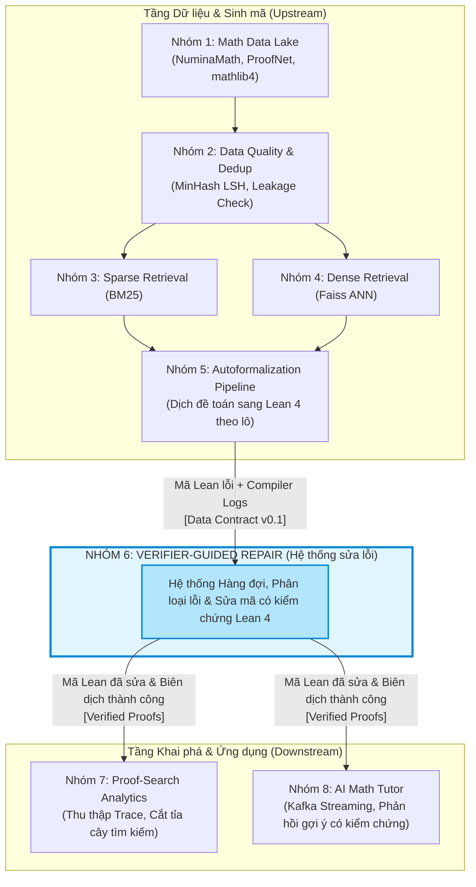
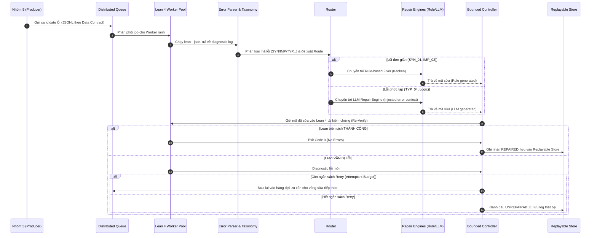

# KIẾN TRÚC HỆ THỐNG (SYSTEM ARCHITECTURE SPECIFICATION)
### ĐỀ TÀI: VERIFIER-GUIDED REPAIR (NHÓM 6 - INT4418 CAO HỌC PTIT)

Tài liệu này đặc tả toàn bộ kiến trúc hệ thống ở mức vĩ mô (kết nối liên nhóm) và mức vi mô (các module nội bộ của Nhóm 6), phục vụ phát triển kỹ thuật, thí nghiệm scalability và trình bày trong báo cáo cuối kỳ.

---

## 1. Sơ đồ Vĩ mô: Vị trí của Nhóm 6 trong Hệ sinh thái AI4Math

Nhóm 6 đóng vai trò mắt xích sửa lỗi then chốt, nhận các mã Lean 4 bị lỗi biên dịch từ Nhóm 5 và cung cấp các định lý/chứng minh đã được kiểm chứng chuẩn xác cho Nhóm 7 và Nhóm 8.



---

## 2. Sơ đồ Vi mô: Chi tiết Kiến trúc Nội bộ Nhóm 6

### 2.1. Sơ đồ khối kiến trúc chuẩn hóa (ASCII Architecture Diagram)

```text
               +-------------------------------------------------+
               |   Đầu vào: Candidate Lean + Compiler Logs       |
               |               (Nhận từ Nhóm 5)                  |
               +-----------------------+-------------------------+
                                       |
                                       v
+--------------------------------------------------------------------------------+
|                                  VÒNG LẶP SỬA LỖI                              |
|                                                                                |
|                    +-----------------------------------+                       |
|  +---------------->|    Input Queue & Task Dispatcher  |<----------------+     |
|  |                 |      (Sử dụng Redis / RabbitMQ)   |                 |     |
|  |                 +-----------------+-----------------+                 |     |
|  |                                   |                                   |     |
|  |                                   v                                   |     |
|  |               +---------------------------------------+               |     |
|  |               |     Structured Error Parser &         |               |     |
|  |               |     Error Taxonomy Classification     |               |     |
|  |               +-------------------+-------------------+               |     |
|  |                                   |                                   |     |
|  |                                   v                                   |     |
|  |               +---------------------------------------+               |     |
|  |               |            Error Router               |               |     |
|  |               +---------+-------------------+---------+               |     |
|  |                         |                   |                         |     |
|  |        (Lỗi đơn giản)   |                   | (Lỗi phức tạp)          |     |
|  |                         v                   v                         |     |
|  |             +-------------------+   +-------------------+             |     |
|  |             | Rule-based Repair |   |    LLM Repair     |             |     |
|  |             | (Tập luật tốn 0   |   | (LLM + Context    |             |     |
|  |             |  token API)       |   |  lỗi bóc tách)    |             |     |
|  |             +---------+---------+   +---------+---------+             |     |
|  |                       |                       |                       |     |
|  |                       +-----------+-----------+                       |     |
|  |                                   |                                   |     |
|  |                                   v                                   |     |
|  |               +---------------------------------------+               |     |
|  |               |     Lean Verifier Worker Pool         |               |     |
|  |               |   (Tập hợp Worker chạy Lean 4)        |               |     |
|  |               +---------+-------------------+---------+               |     |
|  |                         |                   |                         |     |
|  |                 [VẪN BỊ LỖI]         [Biên dịch THÀNH CÔNG]           |     |
|  |                         |                   |                         |     |
|  |                         v                   v                         |     |
|  |             +-----------------------+  +-----------------------+      |     |
|  |             | Bounded Retry Control |  | Semantic Safety Check |      |     |
|  |             | (Kiểm tra Budget)     |  | (Chống cheat / đổi đề)|      |     |
|  |             +---+---------------+---+  +---+---------------+---+      |     |
|  |                 |               |          |               |          |     |
|  | (Còn Budget)    |  (Hết Budget) |          | (Pass)        | (Cheat)  |     |
|  +-----------------+       |       |          |               +----------+     |
+----------------------------|------------------|--------------------------------+
                             |                  |
                             v                  v
                 +---------------------------------------+
                 |          Result & Log Store           |
                 | (Lưu kết quả REPAIRED hoặc FAILED)    |
                 +---------------------------------------+
```

---

### 2.2. Sơ đồ khối phân tầng chức năng (Mermaid Diagram)

```mermaid
flowchart TB
    subgraph Layer1 ["Tầng 1: Thu nhận & Hàng đợi phân tán (Ingestion & Queue Layer)"]
        direction TB
        Input["Đầu vào từ Nhóm 5 (JSONL / Parquet)"] --> Ingest["Ingestion & Schema Validator<br/>[Mekdala Nounou]"]
        Ingest --> Deduplicator["Deduplication by SHA-256 Checksum"]
        Deduplicator --> JobQueue["Distributed Priority Job Queue<br/>[Trần Quang Đức Dũng]<br/>(FIFO vs. Priority Scheduling)"]
    end

    subgraph Layer2 ["Tầng 2: Bóc tách lỗi & Định tuyến (Parsing & Routing Layer)"]
        direction TB
        JobQueue --> ErrorParser["Structured Error Parser<br/>[Khamsing OUTHAIHUENG]<br/>(Line, Column, Severity, Message)"]
        ErrorParser --> Taxonomy["Error Taxonomy Classifier<br/>[Khamsing OUTHAIHUENG]<br/>(SYN_01, IMP_02, ID_03, TYP_04, TMO_05, SEM_06)"]
        Taxonomy --> Router{"Intelligent Error Router<br/>[Khamsing & Tâm]"}
    end

    subgraph Layer3 ["Tầng 3: Các Engine Sửa lỗi (Repair Engines Layer)"]
        direction TB
        Router -- "Lỗi Cú pháp / Import / Ngoặc<br/>(SYN_01, IMP_02, ID_03 đơn giản)" --> RuleFixer["Rule-based Repair Engine<br/>[Lâm Thành Trung]<br/>(Zero-Token Cost: < 5ms)"]
        
        Router -- "Lỗi Kiểu / Logic / Tactic<br/>(TYP_04, ID_03 phức tạp)" --> LLMFixer["LLM Context-Injected Engine<br/>[Nguyễn Xuân Tùng]<br/>(Prompt Injection with Error Diagnostics)"]
    end

    subgraph Layer4 ["Tầng 4: Kiểm chứng & Điều phối Bounded Loop (Verification & Control Layer)"]
        direction TB
        RuleFixer & LLMFixer --> WorkerPool["Lean 4 Verifier Worker Pool<br/>[Trần Quang Đức Dũng]<br/>(Multi-process Lean Compiler: lean --json)"]
        
        WorkerPool -- "Vẫn còn lỗi biên dịch" --> BoundedLoop{"Bounded Retry Controller<br/>[Trần Quang Đức Dũng]<br/>(Attempts <= Budget & Timeout)"}
        
        BoundedLoop -- "Còn Budget: Thử vòng tiếp" --> JobQueue
        BoundedLoop -- "Hết Budget: Thất bại" --> FailedStore["Unrepairable Archive"]

        WorkerPool -- "Biên dịch THÀNH CÔNG" --> SemanticAudit{"Semantic Safety Auditor<br/>[Đào Văn Tâm]<br/>(Chống cheat, bảo tồn chữ ký)"}
        
        SemanticAudit -- "Hợp lệ ngữ nghĩa" --> SuccessStore["Repaired Verified Store<br/>(Mã hoàn chỉnh)"]
        SemanticAudit -- "Làm đổi đề/Cheat" --> BoundedLoop
        
        SuccessStore & FailedStore --> Store["Replayable Error Store & Provenance Log<br/>[Mekdala Nounou & Đào Văn Tâm]<br/>(Phụ lục B JSON Output)"]
        
        Store --> Evaluator["Evaluation & Pareto Benchmark Engine<br/>[Đào Văn Tâm]<br/>(Latency P50/P95, QPS, Token Cost, Compile Rate)"]
    end

    style Layer1 fill:#f3e5f5,stroke:#7b1fa2
    style Layer2 fill:#e8f5e9,stroke:#388e3c
    style Layer3 fill:#fff3e0,stroke:#f57c00
    style Layer4 fill:#e3f2fd,stroke:#1976d2
```



---

## 3. Biểu đồ Tuần tự Thực thi (Execution Sequence Diagram)

Dưới đây là chu trình xử lý end-to-end cho một candidate lỗi đi qua hệ thống sửa:



---

## 4. Bảng Ánh xạ Trách nhiệm Thành viên theo Kiến trúc

| Module trong kiến trúc | Tệp tin mã nguồn tương ứng | Thành viên phụ trách chính | Thành viên dự phòng |
|:---|:---|:---|:---|
| **Data Ingestion & Contract** | `docs/data_contract_group5_group6.md`<br>`data_sample/error_dataset_50.json` | **Mekdala Nounou** | Khamsing OUTHAIHUENG |
| **Parser & Error Taxonomy** | `src/error_parser.py`<br>`docs/error_taxonomy_v0.1.md` | **Khamsing OUTHAIHUENG** | Mekdala Nounou |
| **Rule-based Repair Engine** | `src/rule_repair.py` (Mốc Tuần 4) | **Lâm Thành Trung** | Nguyễn Xuân Tùng |
| **LLM Context Repair Engine** | `src/llm_repair.py` (Mốc Tuần 5) | **Nguyễn Xuân Tùng** | Lâm Thành Trung |
| **Distributed Queue & Worker**| `src/worker_queue.py` (Mốc Tuần 6) | **Trần Quang Đức Dũng** | Đào Văn Tâm |
| **Replayable Store & Replay** | `src/error_store.py`<br>`scripts/replay_error_run.py` | **Mekdala Nounou** | Khamsing OUTHAIHUENG |
| **Evaluation & Cost Analysis** | `src/baseline_repair.py`<br>`scripts/run_experiment.py` | **Đào Văn Tâm** *(Lead)* | Trần Quang Đức Dũng |
